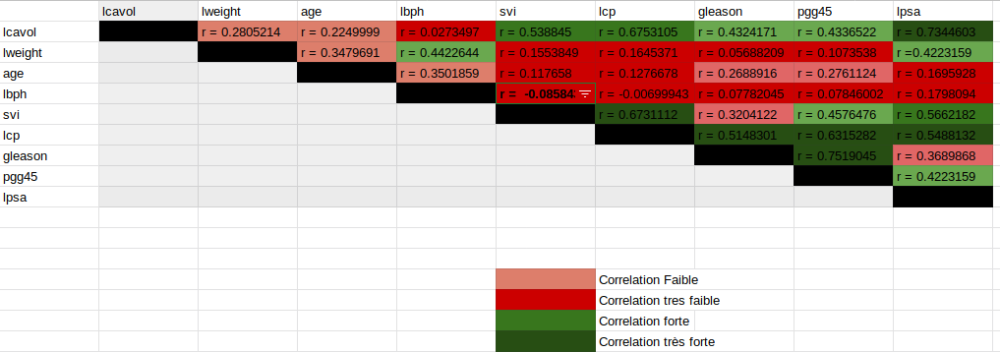

```{r setup, include=FALSE}
knitr::opts_chunk$set(echo = TRUE)
```
# I) Analyse préliminaire des données de prostate
#### Question 1.a:


```{r echo=FALSE, warning=FALSE}
dataCancer=read.table("prostate.data",header=TRUE)
data = dataCancer[-ncol(dataCancer)] 
pro = as.data.frame(cbind(  data[,1],scale(data[,2:4]),data[,5],scale(data[,6]),data[,7],scale(data[,8:9] ) ))
names(pro) = names(data)
pairs(pro, labels =colnames(dataCancer), pch = 21,bg =c("turquoise"))
```

Si on visualise le graphe des correlations par pairs entre lcavol et  les autres predicteurs, On peut remarquer que le nuage de points entre (\(\textit{lcavol}\), \(\textit{lpsa}\))  et (\(\textit{lcavol}\), \(\textit{lcp}\)) se regroupe autour d'une ligne, en soulignant  un fort alignement  pour le nuage de points (\(\textit{lcavol}\), \(\textit{lpsa}\)). Pour la visualisation des autres nuages de points  entre lcavol et les autres prédicteurs quantitatifs et qualitatifs, on peut pas déduire une information sur le degré de corrélation.

#### Question 1.b:

La visualisation par paires des corrélations permet d'avoir une idée sur la dépedance  entre (\(\textit{lcavol}\), \(\textit{lpsa}\))  et (\(\textit{lcavol}\), \(\textit{lcp}\)), vu que ça suit une relation classique: dans ce cas une fonction affine. Cependant, on peut en déduire un idée sur la dépendance entre \(\textit{lcavol}\) et les autres prédicteurs;  C'est ce qui nous pousse à  utiliser la commande R <cor> qui  determine le coefficient de correlation entre deux grandeurs on obtient le tableau ci-dessous:

```{r figurename, echo=FALSE, fig.cap=" ", out.width = '90%'}

```
On peut remarquer que certains prédicteurs sont corrélés entre eux:

\item 
1)svi est corrélé à \(\textit{lcavol}\) ; lcp est corrélé à \(\textit{lcavol}\) ; \(\textit{lcavol}\) est coréllé à \(\textit{svi}\).

Ainsi \(\textit{lcp}\) a un impact sur la dépendance entre \(\textit{svi }\) et \(\textit{lcavol}\) et aussi  sur la dépendance entre \(\textit{gleason }\) et \(\textit{lcavol}\).

2)Dépendence très faible entre \(\textit{lcavol}\) et \(\textit{lweight}\) et \(\textit{age}\). Ainsi qu'entre  \(\textit{lbph}\) et tous les autres préditeurs.

# II) Régression linéaire
#### a) Equation mathématique de la régression linéaire et explications du modèle:
Les deux variables \(\textit{svi}\)  et \(\textit{gleason}\)  sont considérées ci-dessous comme étant des variables qualitatifs.
\(\textit{svi}\) posséde deux niveaux de modalité et \(\textit{gleason}\) posséde 4 niveaux de modalités.
Le modéle initiale peut se mettre de cette manière:


$Y_i =  \alpha_0 + \beta_1lweight_i + \beta_2age_i  + \beta_3lbph_i + \beta_{40}\mathbb 1_{svi = 0} + \beta_{41}\mathbb 1_{svi = 1} + \beta_5lcp_i + \beta_{6}\mathbb 1_{gleason = 6} + \beta_{7}\mathbb 1_{gleason = 7}+ \beta_{8}\mathbb 1_{gleason = 8} + \beta_{9}\mathbb 1_{gleason = 9} + \beta_{10}pgg45_i + \varepsilon_i$


En faisant deux  reparamétrisations  faisant apparaître des effets différentiels par rapport à deux  niveaux de référence successifs  qu'est \(<\textit{gleason} = 6>\) et \(<\textit{svi} = 0>\) dans ce cas on obtient:

 \(Y_i =  \beta_0 + \beta_1lweight_i + \beta_2age_i  + \beta_3lbph_i + \beta_4\mathbb 1_{svi = 1} + \beta_5lcp_i +  \beta_{7}\mathbb 1_{gleason = 7}+ \beta_{8}\mathbb 1_{gleason = 8} + \beta_{9}\mathbb 1_{gleason = 9} + \beta_{10}pgg45_i + \varepsilon_i\)

Ainsi que les valeurs de \(\textit{gleason7}\) et \(\textit{gleason8}\) et \(\textit{gleason9}\)  sont relatifs au niveau de référence \(<\textit{gleason} = 6>\) .


#### b) Summary:
```{r  echo=FALSE, warning=FALSE }
###########Regression de lcavol sur tous les autres predicteurs##############
proC = pro
n = dim(proC)[1]
proC$svi = factor(proC$svi)
proC$gleason = factor(proC$gleason)
lcavol = proC$lcavol
lmLcavol= lm(lcavol ~ . ,data=proC[,-1])
s = summary(lmLcavol)
s
```


#### c) Elimination de lcp et lpsa du modèle de regression:

En eliminant \(\textit{lcp}\)  et \(\textit{lpsa}\)  de notre modèle de regression on remarque que la quasi-totalité de l'information de \(\textit{lcavol}\)  sera dans \(\textit{svi}\)  et \(\textit{gleason}\) , ce qui raisonable car dans la partie 1) on a souligné la forte corrélation entre \(\textit{lcp}\)  et \(\textit{svi}\)  et \(\textit{svi}\)  et \(\textit{lpsa}\)  d'une part et entre \(\textit{lcp}\)  et \(\textit{gleason}\)  d'autre part. Ce transfert d'information est dû à la forte correlation de \(\textit{lcavol}\)  avec \(\textit{lpsa}\)  et \(\textit{lcp}\) .

Ceci confirmé en simulant ce nouvau modèle: on obtient une \(p-value  = 0.000291\) pour \(\textit{svi}\). 

De plus le coefficient de corrélation de ce nouveau modèle a diminué  de 0.6865 à 0.4327, Le modèle est moins cohérent que le premier, Ce qui est logique car \(\textit{lpsa}\)  et \(\textit{lcp}\) sont les plus corréllées à  \(\textit{lcavol}\).
```{r echo=FALSE, warning=FALSE }
###########On enleve lpsa et lcp de la ref=gression##############
proC = pro
n = dim(proC)[1]
proC$svi = factor(proC$svi)
proC$gleason = factor(proC$gleason)
lcavol = proC$lcavol
lmLcavol= lm(lcavol ~ proC$svi+proC$gleason+lweight+age+lbph+pgg45 ,data=proC[,-1])
s = summary(lmLcavol)
s
```

#### d) Impact de lcp sur le modèle de la question1:
```{r echo=FALSE, warning=FALSE}

stdLCP = 0.118954
betaLcp = 0.563158
x = 86
qtStudent = qt(1- 0.05/2, x )
partiegauche = betaLcp - stdLCP*qtStudent
partieDroite = betaLcp + stdLCP*qtStudent

```
Intervalle de Confiance: #latex

En utilisant R On obtient:  \([0.3266853, 0.7996307]\): On remarque que 0 n'appartient pas à l'intervalle de confiance. et donc On peut rejetter l'hypothèse nulle qu'est \(\beta = 0 \).

Conclusion: On obtient une \(p-value  = 8.58e-06\) pour \(\textit{lcp}\) qui est très faible, ce qui soutenu par l'intervalle de confiance étroit.

#### e) Distribution de la statistique t et cohérence des variables indiquées *:

```{r echo=FALSE, warning=FALSE}
#2e)
t<-qt(1-(0.05)/2, 86)

```
Sous l'hypothèse nulle: La distribution de la probabilité de t est celle de la distribution de la loi de student.

Le paramètre de la loi de student est égale à $n -p - 1 = 97 -10 -1 = 86$.

Avec:  $n$ = nombre d'obsevations, $p$ = nombre de variables.

La valeur de t pour laquel $P = 0.05$ est égale à \({F_{st(86)} }^{-1}(1-0.05/2)\) = 1.987608 ou -1.987608

La variable \(\textit{age}\) est notée $*$, Ce qui est cohérent car sa \(|t-value| = |2.205| = 2.205 > |t| = 1.987608 \).

La variable \(\textit{pgg45}\) est notée $*$, Ce qui est cohérent car sa \(|t-value| = |-2.080| = 2.080 > |t| = 1.987608 \).


#### f) Visualisation des lcavol estimés et résidus:
 
```{r echo=FALSE, warning=FALSE}
ValeursActuelles = data[,1]
ValeursEstimees = fitted(lmLcavol)
plot(ValeursEstimees, ValeursActuelles, col = "brown4" ,main = "Valeurs de lcavol estimées en fonction des Valeurs actuelles.")
y1<-sort.int(fitted(lmLcavol))
y2<-sort.int(data[,1])
observations = 1:97
plot(observations,y1, col = "blue" , main = "Valeurs de lcavol estimées(bleu) et Actuelles(rouge).")
lines(observations, y2, col="red")

```

L'allure de la densité des résidus converge vers une densité d'une gaussienne, voire la figure de l'histogramme des résidus.
```{r echo=FALSE, warning=FALSE }

hist(lmLcavol$residuals, col = "brown4", border = "khaki4", freq=FALSE , main=" Histogramme des résidus")
par(new=TRUE)
plot(density(lmLcavol$residuals), col="brown1", main="", xlab="", ylab="", xaxt="n", yaxt="n")


```

La valeur RSS vaut: 41.81407

```{r echo=FALSE, warning=FALSE}
rss = sum(lmLcavol$residuals^2)
```


# III) Effet des prédicteurs qualitatifs:

On peut affirmer à l'aide de ANOVA que Les deux prédicteurs qualitatifs: \(\textit{svi}\)  et \(\textit{gleason}\) ont un effet important sur l'information de lcavol , vu que leurs p-value sont faibles :  $2.23e-09$ pour \(\textit{svi}\) et $0.00233$ pour \(\textit{gleason}\).

```{r echo=FALSE, warning=FALSE}
anova <- aov(lcavol ~ factor(svi)*factor(gleason), proC)
model.tables(anova,"means")
summary(anova)
```


# IV) Best Subset Selection:

```{r echo=FALSE, warning=FALSE}
#part4
lm1<-lm(lcavol~1,data=proC)
lm2<-lm(lcavol~.,data=proC[,c(1,4,9)])
lm3<-lm(lcavol~.,data=proC[,c(1,2,9)])
Combine <- combn(proC[,2:9],2)
Combine[,1]
```

```{r echo=FALSE, warning=FALSE}
RSSmin <- function(k){
  if( k == 0 ){
    lm1 <- lm(lcavol~1,data=proC)
    RSS <- sum(resid(lm1)^2)
    return(RSS,k)
  }
  else{
    RSS = 1000000000000000
    k = 0
    for(i in 1:ncol(Combine)){
      lm <- lm(lcavol~., )
      RS <- sum(resid(lm)^2)
      if(RS < RSS){
        RSS = RS
        k = i
      }
    }
    return(RSS,k)
    
  }
}

s <- as.data.frame(cbind(Combine[,2][1],Combine[,2][2]))
s
#lm <- lm(lcavol~., s)
#summary(lm)
#resultat <- RSSmin(2)
#resultat[1]
```

